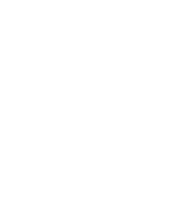

The [Dartmouth Brain Imaging Center (DBIC)](https://dartmouth.edu/dbic) is a research resource that is provided by Dartmouth College to all brain researchers in the Dartmouth community.
Please visit the [DBIC website](https://www.dartmouth.edu/dbic/) for more information.

In this repository, we develop the [DBIC Handbook](https://dbic-handbook.readthedocs.io/en/latest/).

# Contributing to DBIC

DBIC Handbook needs your contributions, DBIC people.
We welcome new contributors, and we appreciate all contributions to the project!

For a current list of our contributors, please see our [Contributors appendix](https://github.com/dbic/handbook/blob/master/src/99-appendices/01-contributors.md).

When you're ready to get started, check out [our contributing guidelines](https://github.com/dbic/handbook/blob/master/CONTRIBUTING.md).

We ask that all contributions to DBIC, across all project-related spaces (including but not limited to
[GitHub](https://github.com/dbic) and
the [mrusers mailing list](mailto:mrusers@groups.dartmouth.edu)),
adhere to our [code of conduct](https://github.com/dbic/handbook/blob/master/CODE_OF_CONDUCT.md).
