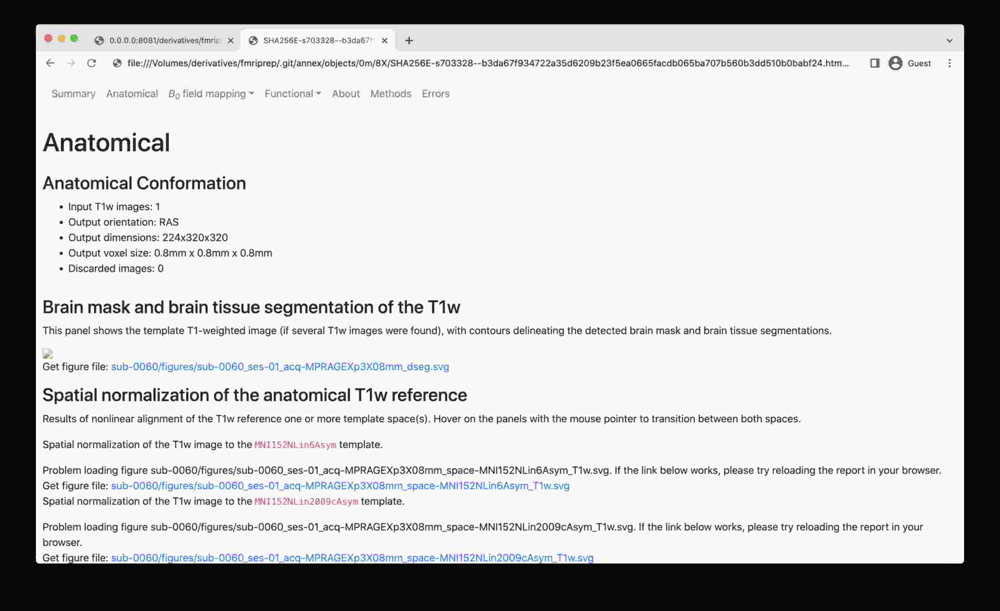
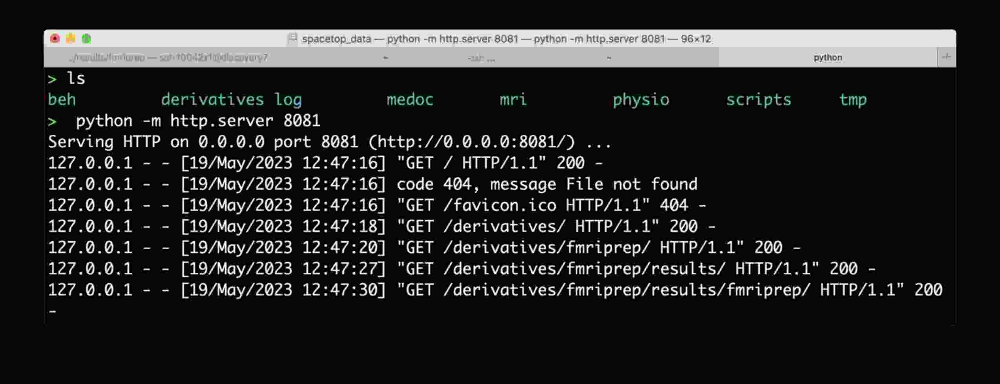
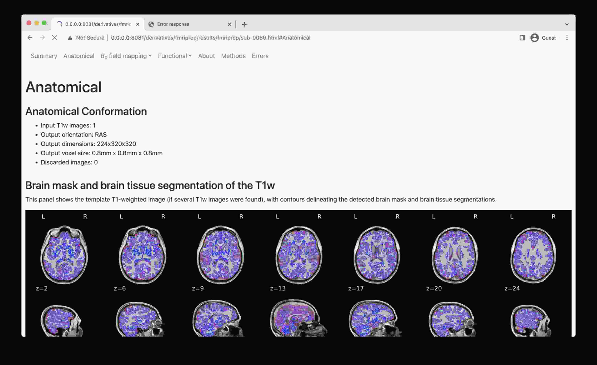

# DataLad

The [DataLad Handbook](http://handbook.datalad.org) is the ultimate introduction to DataLad.

## An example of sample analysis using DataLad & containers

This is an example of how to organize your study as a DataLad dataset and
use the [datalad-container](http://docs.datalad.org/projects/container/en/latest/index.html)
extension to facilitate efficient and reproducible research:

```bash
# Create a dataset where we will keep all bits and pieces of a study.
# With -c text2git we instruct data files to go to the annex, while
# text files (code, docs, scripts) go to git.
datalad create -c text2git 1021_actions
cd 1021_actions
# Install a (sub)dataset with (Singularity) containers
datalad install -d . http://github.com/repronim/containers
# Install a ReproIn'ed dataset from rolando
datalad install -d . -s rolando.cns.dartmouth.edu:/inbox/BIDS/Haxby/Sam/1021_actions bids
# Get only sample data (1 subject) for the demonstration here
datalad get bids/sub-sid000005
```

Meanwhile, have a look at

- [a typical workflow](https://github.com/ReproNim/containers/#a-typical-workflow) with ReproNim/containers

- an [example](https://github.com/ReproNim/reproman/pull/438), a bit too convoluted at the moment,
  of using either `datalad run` or `reproman run` for scheduling parallel execution across the cluster

- possible future answers on
  [NeuroStars](https://neurostars.org/t/using-fmriprep-with-datalad-containers-run/5327)

## How to view mriqc/fmriprep/etc DataLad'ified results in a browser

**The problem**: a web browser de-references symlinks, which leads the `.html` file into a `.git/annex/objects` subfolder and thus makes it impossible to see the images.



To overcome this, start a simple web server, e.g. the one provided by Python itself, and navigate to the file of interest:

- Run this line of code in the local directory (e.g. where you have mounted the Discovery directory, or have a local clone with the data fetched): `python -m http.server 8081`
- Copy the URL it prints out (typically <http://0.0.0.0:8081/>) into your web browser address bar
- Now you should be able to access HTML outputs with embedded images at that address -- just navigate to the `.html` file of interest and open it

### DataLad way

Make sure that git is configured, in that it knows about you.
If `git config user.name` prints something, then most likely you are all set.
If it comes out empty, please do

```shell
git config --global user.name "First Last"
git config --global user.email "someemail@address"
```

while replacing those values with your name and email.

If you are doing this on the Discovery HPC, please first read the
[section on the Discovery filesystem](../computing/discovery.md#about-filedirectory-permissions-and-acls)
on how to configure git for Discovery's ACL filesystem, unless you know that it is pure POSIX.

Then it is recommended to create a directory for your study first, e.g. `mkdir ID_name` where `ID_name` is the same as on rolando, e.g. `0001_dbic-animals`, and `cd` into it:

```shell
mkdir 0001_dbic-animals
cd 0001_dbic-animals
```

Use the [datalad install](https://docs.datalad.org/en/stable/generated/man/datalad-install.html) command
to obtain the dataset, and then [datalad get](http://docs.datalad.org/en/stable/generated/man/datalad-get.html) to
obtain specific files.  If you are greedy, add `-r` to get the full hierarchy of datasets, and/or `-g`
to immediately fetch all data files as well:

```shell
datalad install -s your-login-on-rolando@rolando.cns.dartmouth.edu:/inbox/BIDS/dbic/0001_dbic-animals dbic
cd dbic
datalad get -J4 sub-*  # to get only converted data, without tarballs etc.
```

Later upgrades, to fetch new data (subjects etc.), can be done via

```shell
datalad update --how merge -r
```



