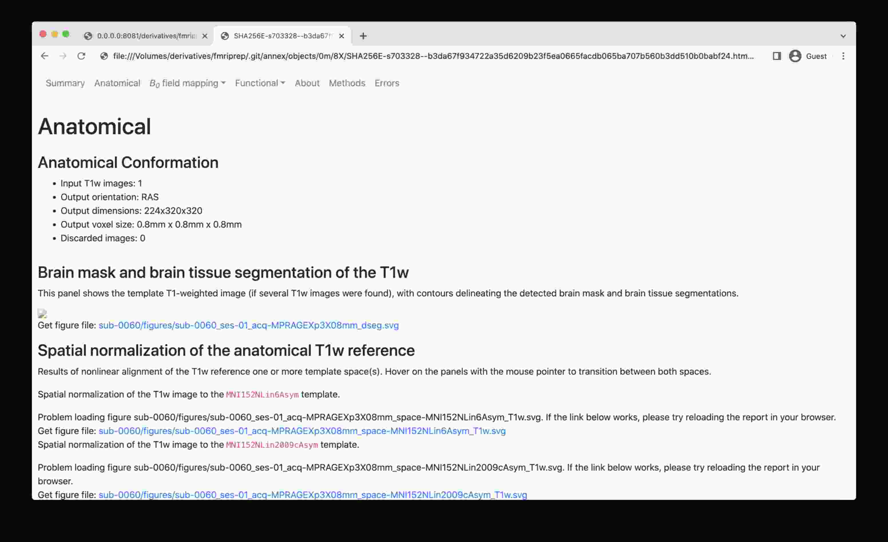
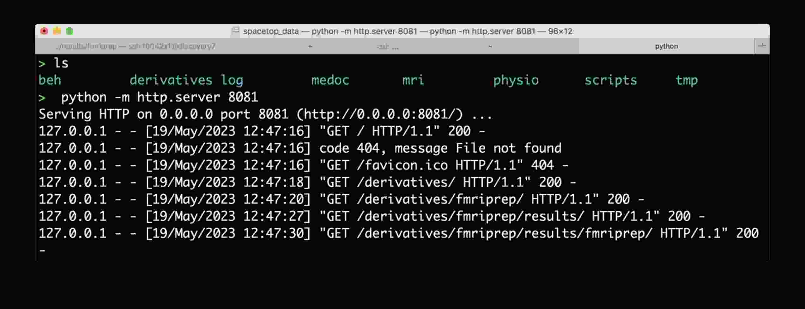
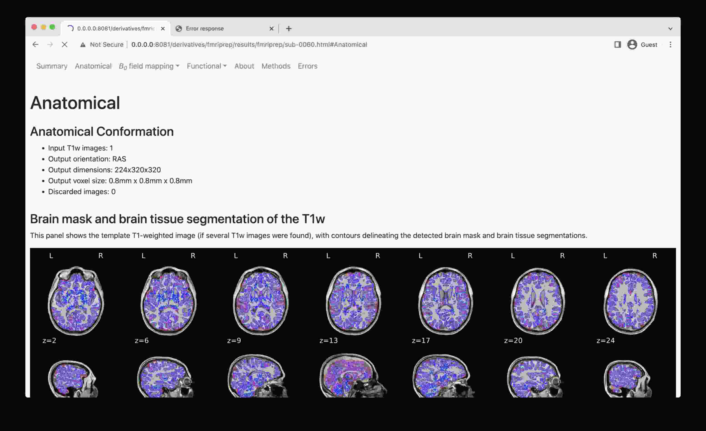

# DataLad

The DataLad Handbook at [http://handbook.datalad.org](http://handbook.datalad.org)
is the ultimate introduction into DataLad. 

## An example of sample analysis using DataLad & containers
 
This is a WiP example on how to organize your study as DataLad dataset and
use [datalad-container](http://docs.datalad.org/projects/container/en/latest/index.html)
extension to facilitate efficient and reproducible research:
 
```bash
# Create a dataset where we will keep all bits and pieces of a study
# With -c text2git we instruct to have data files to go to annex, while
# text files (code, docs, scripts) to git
datalad create -c text2git 1021_actions
cd 1021_actions
# Install a (sub)dataset with (Singularity) containers
datalad install -d . http://github.com/repronim/containers
# Install ReproIn'ed dataset from rolando
datalad install -d . -s rolando.cns.dartmouth.edu:/inbox/BIDS/Haxby/Sam/1021_actions bids
# Getting only a sample data (1 subject) for demonstration here
datalad get bids/sub-sid000005
```

TODO: finish

Meanwhile, have a look at 

- https://github.com/ReproNim/containers/#a-typical-workflow 
- a bit too convoluted ATM example with either `datalad run` or `reproman run` for
  scheduling parallel execution across cluster: https://github.com/ReproNim/reproman/pull/438
- and possible future answers on
  https://neurostars.org/t/using-fmriprep-with-datalad-containers-run/5327


## How to view mriqc/fmriprep/etc DataLad'ified results in a browser

**The problem**: web browser de-references symlinks, which leads `.html` into a `.git/annex/objects` subfolder and thus makes it impossible to see the images.



To overcome this, start a simple web server, e.g. as provided by Python itself, and navigate to the file of interest:

- Run this line of code on local directory (e.g., where you have mounted discovery directory, or have a local clone with data fetched): `python -m http.server 8081`
- Copy the URL it prints out (typically  http://0.0.0.0:8081/) into your web browser address bar
- Now you should be able to access HTML outputs with embedded images at that address -- just navigate to .html file of interest and open it.



