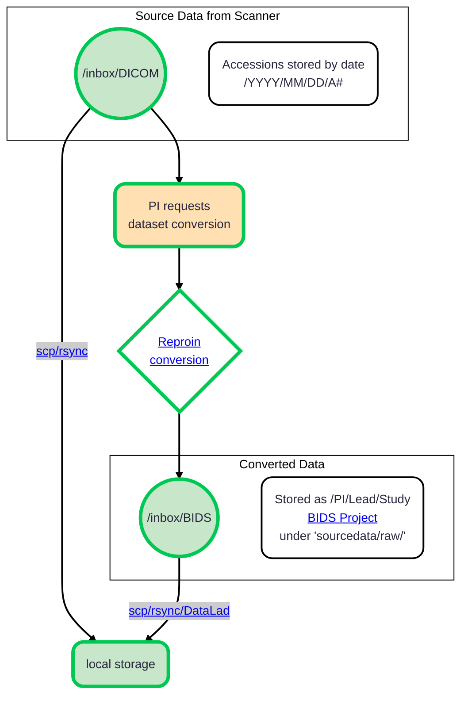

# Neuroimaging Data Access

All data is collected and provided for access and conversion into BIDS on rolando.cns.dartmouth.edu.

You need to request access permissions from [Research Computing](mailto:research.computing@dartmouth.edu).




N.B. Storing under `sourcedata/raw/` is a planned solution.
At the moment it would be just in the root of the dataset.

## DICOMs

All dicoms are organized into `YEAR/MONTH/DATE/ACCESSION` hierarchy under `/inbox/DICOM`.
You can `scp` or `rsync` them to your local storage.

## BIDS

At the moment, upon request from a lab member to [Yaroslav Halchenko](mailto:yoh@dartmouth.edu), data is converted from DICOMs into BIDS within the directories hierarchy under `/inbox/BIDS`, following convention described in the [ReproIn section](./reproin.md).
If any metadata (`subject_id` or `session_id`) need to be corrected, inform ahead of time.

These directories are also DataLad datasets, so you have two options on how to transfer them:

### DataLad

Before you proceed, please refer to the [DataLad section](../basics/datalad.md) of the handbook.
When you are all set, you can do simply something like

```commandline
datalad clone myrolandoid@rolando.cns.dartmouth.edu:/inbox/BIDS/dbic/dbic-animals dbic-animals
```

This will create a local clone of the dataset, and you can use `datalad get` to get the data you need.

### Old fashion way

`scp` or `rsync`. But you would need to take care about de-referencing symlinks.

    rsync --exclude=.git --copy-links -r \
        rolando.cns.dartmouth.edu:/inbox/BIDS/dbic/dbic-animals dbic-animals


You could add `--exclude=sourcedata` and/or `--exclude=derivatives` to exclude folders with original DICOMS and possible derivatives (fmriqc, etc).

