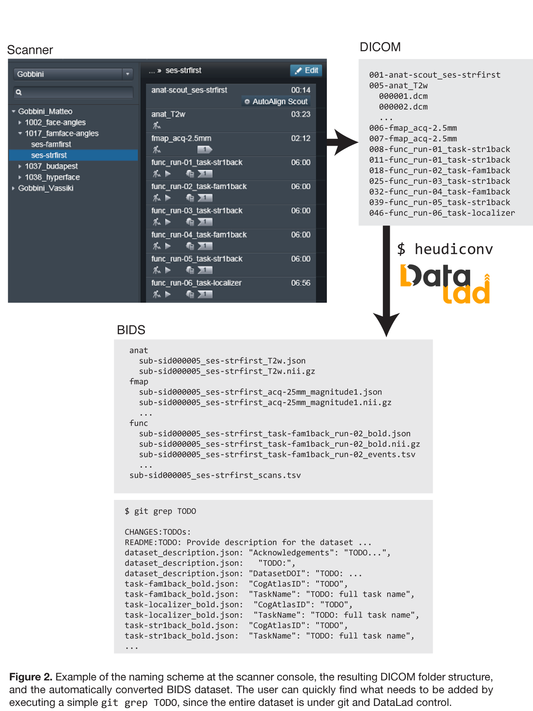
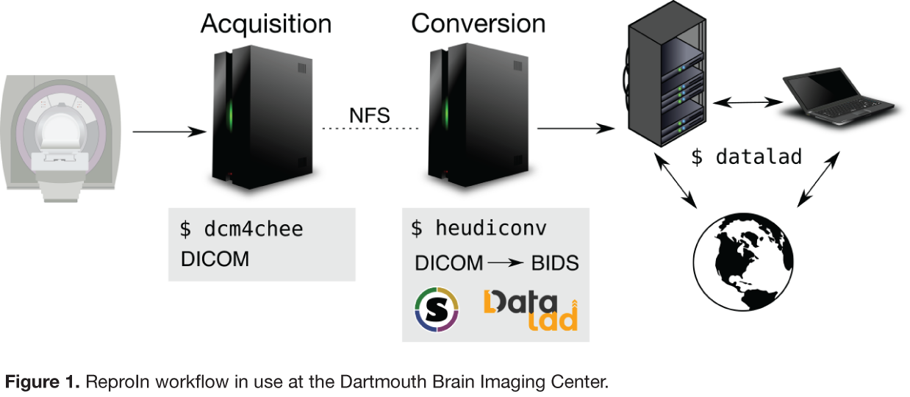

# Schematic description of the setup

All MRI exam cards are organized in a standardized way, and sequences follow the ReproIn convention, which is described in the [ReproIn section](reproin.md):

Collected data is transferred to the INBOX and converted (on rolando) to BIDS semi-automatically using [HeuDiConv](https://github.com/nipy/heudiconv/) with the [ReproIn heuristic](https://github.com/nipy/heudiconv/blob/master/heudiconv/heuristics/reproin.py).

