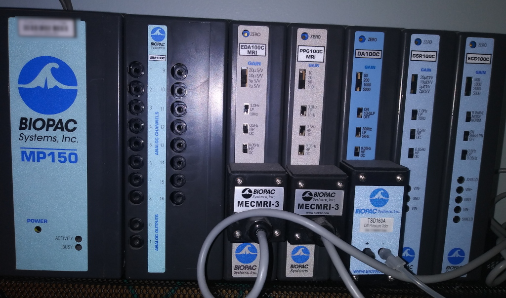

# MR Peripherals

## Trigger pulse/Response collection

Two options are deployed and available

### Lumina

### Current Designs

## Physiology Recordings

### Siemens built-ins

#### HOWTO use

TODO

### BIOPAC MP150

Connected to 

- chest belt for respiratory 
- ...

#### HOWTO use

TODO

#### Notes

- make sure enabling recording of the absolute timestamp (TODO: instructions), so they later could be automagically sliced into BIDS
- make sure that collection box uses NTP to keep its clock "in sync" with the absolute time of the planet
- TODO: think about introducing into data some "synchronization signature" to provide guarantee/QA of correct temporal alignment with MR data

### Tools

Consider using/contributing to [Phys2BIDS](https://github.com/physiopy/phys2bids)
