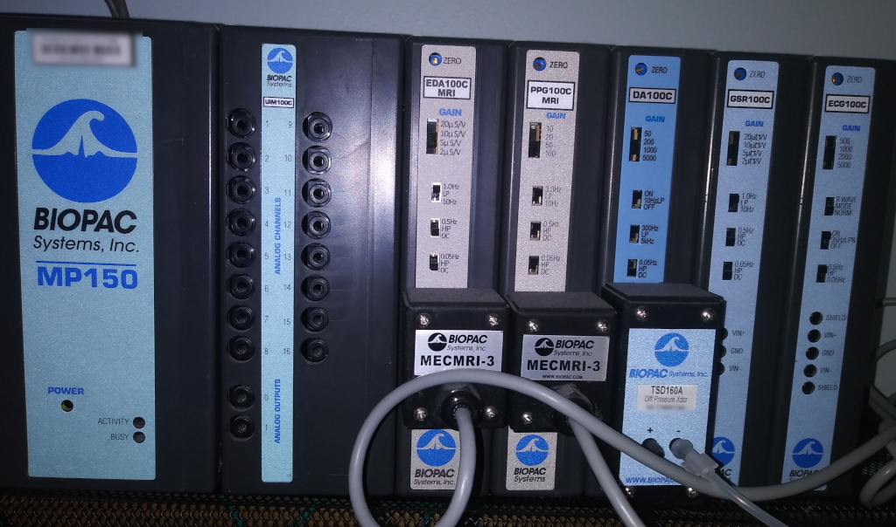

# MR Peripherals

## Trigger pulse/Response collection

Two options are deployed and available.

### Lumina

TODO

### Current Designs

TODO

## Physiology Recordings

### Siemens built-ins

#### HOWTO use

TODO

### BIOPAC MP150

Connected to

- a chest belt for respiration
- ...

#### HOWTO use

TODO

#### Notes

- make sure to enable recording of the absolute timestamp (TODO: instructions), so that the recordings can later be automagically sliced into BIDS
- make sure that the collection box uses NTP to keep its clock "in sync" with the absolute time of the planet
- TODO: think about introducing some "synchronization signature" into the data to guarantee (and QA) correct temporal alignment with the MR data

### Tools

Consider using/contributing to [Phys2BIDS](https://github.com/physiopy/phys2bids)
